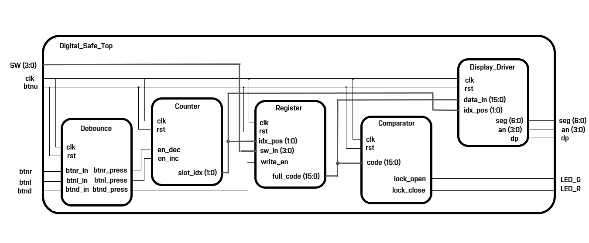

# Digital-Safe - Nexys A7-50T

### Contributors
> Hynek Svoboda
> Dávid Szalay
> Daniel Vana

## System Schematic

## Hardware Interface

| Signal Name | Direction | Width | Physical Hardware | Description |
|:--- |:---:|:---:|:--- |:--- |
| **clk** | Input | 1 | Onboard 100MHz | Main system clock |
| **btnd** | Input | 1 | BTND (Down) | Confirmation / Save digit |
| **btnl** | Input | 1 | BTNL (Left) | Increment slot index (Move Left) |
| **btnr** | Input | 1 | BTNR (Right) | Decrement slot index (Move Right) |
| **btnu** | Input | 1 | BTNU (Up) | System Reset |
| **sw** | Input | 4 | SW(3:0) | 4-bit binary input for digits |
| **seg** | Output | 7 | 7-Segment Cathodes | Pattern for numbers 0-9 |
| **an** | Output | 4 | 7-Segment Anodes | Active-low display selectors |
| **dp** | Output | 1 | Decimal Point | Cursor indicating active digit |
| **led_g** | Output | 1 | LED16 (Green) | Logic High when safe is OPEN |
| **led_r** | Output | 1 | LED17 (Red) | Logic High when safe is LOCKED |
