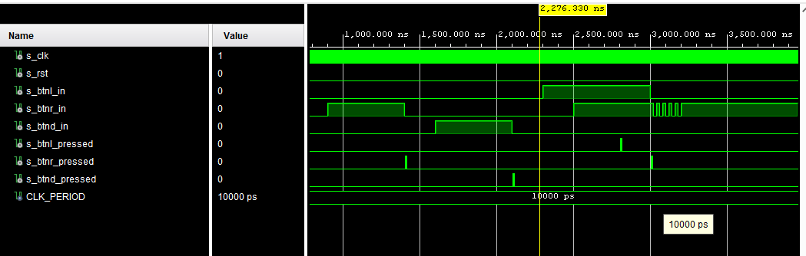
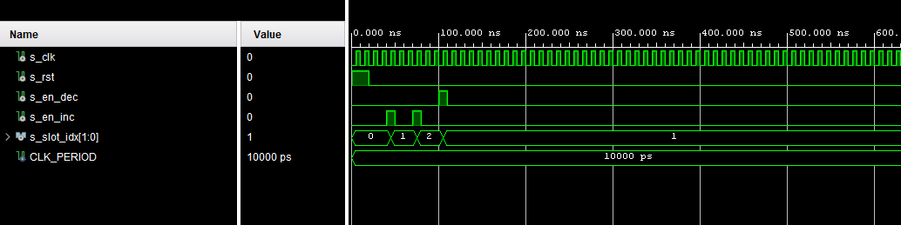
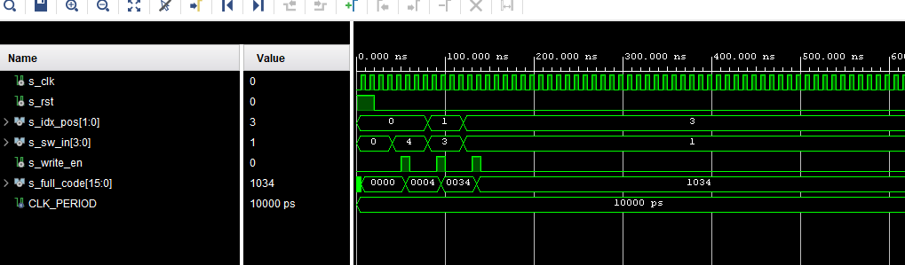
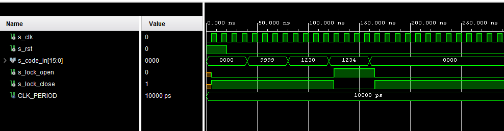
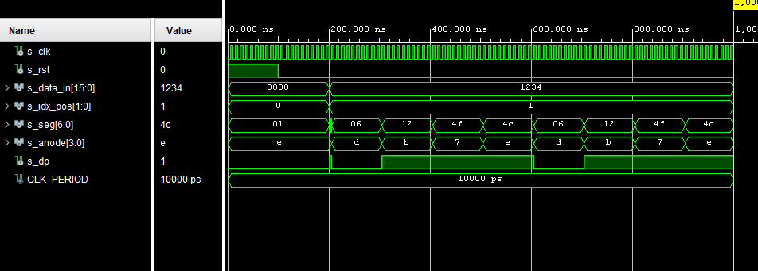

# Digital-Safe - Nexys A7-50T

## 👥 Team members 
> [Hynek Svoboda](https://github.com/HynekSvoboda), 
> [Dávid Szalay](https://github.com/Szalo03), 
> [Daniel Vana](https://github.com/DanVanex)

## ⚽ Main goal
Implement a 4-digit code entry system with visual feedback. Store entered codes in registers and compare to the preset combination to indicate success or failure.

## 🚀 Functionality and Features

* **Code Entry:** The system allows entering a 4-digit code. Each position holds a 4-bit value (0–15), which is set primarily using hardware switches.
* **Slot Navigation:** The user can freely move between individual code positions (slots) using buttons and edit them in any order.
* **Real-Time Display:** The currently assembled code is continuously shown on a seven-segment display, including an indication of the position currently being edited.
* **Immediate Evaluation:** The hardware compares the entered code in memory with the secret password on every clock cycle. The status is indicated by colored LEDs.
* **Debouncing:** All mechanical button inputs are debounced, ensuring accurate reading of button presses without unwanted multiple registrations.

## 🗺️ System Schematic

## 📟 Hardware Interface

| Signal Name | Direction | Width | Physical Hardware | Description |
|:--- |:---:|:---:|:--- |:--- |
| **clk** | Input | 1 | Onboard 100MHz | Main system clock |
| **btnd** | Input | 1 | BTND (Down) | Confirmation / Save digit |
| **btnl** | Input | 1 | BTNL (Left) | Increment slot index (Move Left) |
| **btnr** | Input | 1 | BTNR (Right) | Decrement slot index (Move Right) |
| **btnu** | Input | 1 | BTNU (Up) | System Reset |
| **sw** | Input | 4 | SW(3:0) | 4-bit binary input for digits |
| **seg** | Output | 7 | 7-Segment Cathodes | Pattern for numbers 0-9 |
| **an** | Output | 4 | 7-Segment Anodes | Active-low display selectors |
| **dp** | Output | 1 | Decimal Point | Cursor indicating active digit |
| **led_17g** | Output | 1 | LED16 (Green) | Logic High when safe is OPEN |
| **led_16r** | Output | 1 | LED17 (Red) | Logic High when safe is LOCKED |

## 🧪 [Testbench](<TestBenches>) & [Simulation](<Image/Simulation>)

A testbench is a crucial simulation environment used to verify the functionality of the digital design before deploying it to the physical FPGA board. The testbench code is never uploaded to the hardware itself; instead, it acts as a virtual laboratory.

**Key purposes of the testbench in this project:**
* **Stimuli Generation:** It artificially generates all necessary input signals, such as the system clock (`clk`) and simulated user interactions (button presses and switch toggles).
* **Logic Verification:** It runs predefined test scenarios to check if the circuit behaves as expected (e.g., verifying the lock states for correct and incorrect password entries).
* **Deep Debugging:** It allows viewing detailed time waveforms of all internal signals, making it much easier to find and fix logic errors without needing the physical development board.

### ⚙️[Debounce](<Project/Digital_Safe/Digital_Safe.srcs/sources_1/imports/DE1/Project/Digital Safe/Digital Safe.srcs/sources_1/imports/new/debounce.vhd>) Testbench 

This specific testbench verifies the reliability of the button debouncing logic by simulating real-world mechanical switch behavior. Key test scenarios include:

* **Clean Presses:** Verifies that a normal, stable button press generates exactly one clean output pulse.
* **Overlapping Inputs:** Ensures the logic correctly handles multiple buttons being pressed simultaneously without interference.
* **Mechanical Bouncing:** Simulates rapid, unstable signal fluctuations (switch noise) to confirm the module effectively filters out the noise and prevents false, multiple triggers.

### 🔢 [Counter](<Project/Digital_Safe/Digital_Safe.srcs/sources_1/imports/DE1/Lab_4/Binary_Counter/Binary_Counter.srcs/sources_1/new/counter.vhd>) Testbench 

This testbench verifies the navigation logic used to track which digit of the password is currently being edited (slot index 0 to 3). Key test scenarios include:

* **Initialization:** Verifies that a system reset correctly returns the active slot index to the first position (`0`).
* **Incrementing (Move Left):** Tests the `en_inc` signal to ensure the counter correctly steps forward through the digit positions.
* **Decrementing (Move Right):** Tests the `en_dec` signal to verify the counter correctly steps backward.
* **Wrap-around Logic:** The underlying module design also ensures seamless cyclic navigation (e.g., stepping forward from the last position wraps around to the first).

### 💾 [Register](<Project/Digital_Safe/Digital_Safe.srcs/sources_1/new/Registr.vhd>) Testbench 

This testbench verifies the 16-bit memory module responsible for storing the assembled 4-digit PIN code. It ensures that data is written exactly to the targeted digit slot without affecting the rest of the code. Key test scenarios include:

* **Initialization:** Verifies that a system reset properly clears all internal storage slots (outputting `0000`).
* **Targeted Memory Write:** Tests writing specific 4-bit values to different slots (e.g., slot 0, slot 1, slot 3) based on the `idx_pos` pointer.
* **Data Retention:** Demonstrates that writing to one slot does not overwrite or corrupt data previously stored in other slots (e.g., skipping slot 2 keeps it at `0`, successfully forming the final hex code `1034`).

### ⚖️ [Comparator](<Project/Digital_Safe/Digital_Safe.srcs/sources_1/new/Comparator.vhd>) Testbench 

This testbench verifies the core security logic of the digital safe. It ensures that the system continuously and accurately evaluates the user's inputted code against the hardcoded secret password (e.g., `1234`). Key test scenarios include:

* **Default Security State:** Verifies that upon system reset, the comparator defaults to the locked state (`lock_close` is active).
* **Incorrect Code Rejection:** Tests completely wrong inputs (e.g., `9999`) and partially correct inputs (e.g., `1230`) to ensure the safe remains strictly locked.
* **Successful Unlock:** Demonstrates that providing the exact matching code (`1234`) successfully switches the outputs, deactivating `lock_close` and activating `lock_open` (Green LED).
* **Dynamic Relocking:** Confirms that modifying the code after a successful unlock immediately reverts the system back to a locked state.

### 📺 [Display Driver](<Project/Digital_Safe/Digital_Safe.srcs/sources_1/imports/DE1/Project/Digital Safe/Digital Safe.srcs/sources_1/imports/DE1/Lab_5/display/display.srcs/sources_1/new/display_driver.vhd>) Testbench 

This testbench validates the display multiplexing and data decoding logic for the 4-digit seven-segment display. The simulation environment uses a scaled-down clock divider to rapidly visualize the anode switching process. Key test scenarios include:

* **Multiplexing Verification:** Confirms that the `anode` signal continuously cycles through the active-low states (`1110`, `1101`, `1011`, `0111`) to drive one digit at a time.
* **Data Decoding:** Ensures that the correct 4-bit nibble from the 16-bit `data_in` code is routed to the 7-segment decoder precisely when its corresponding anode is active.
* **Edit Position Indicator:** Verifies the decimal point (`dp`) logic, proving that the dot illuminates (goes active-low) exclusively on the digit currently targeted by the `idx_pos` pointer, acting as a visual cursor for the user.

